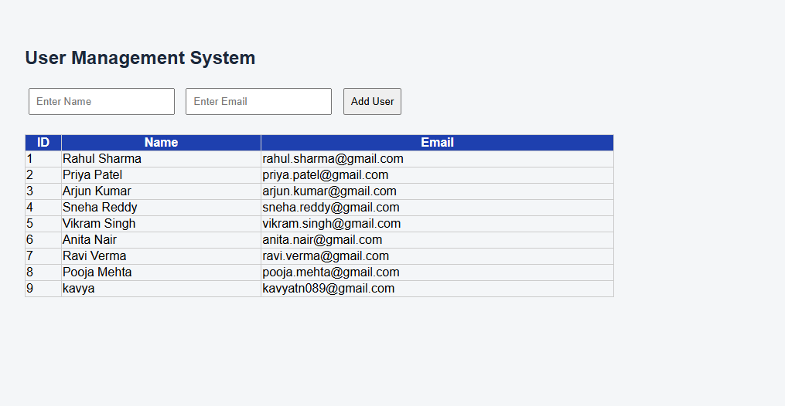

# Python Fullstack Task 1
## User Management System

A Python Fullstack Web Application built using Flask and SQLite database.

---

##  Project Overview
This is a simple *User Management System* where users can be added, stored and displayed using a clean web interface. The application demonstrates fullstack development using Python Flask as backend and HTML/CSS as frontend.

---

##  Features Implemented
1. ✅ Home page with user input form
2. ✅ Submit form data to Flask backend
3. ✅ Store user details in SQLite database
4. ✅ Fetch and display all users in a table
5. ✅ Clean UI with basic CSS styling

---

##  Technologies Used

| Technology | Purpose |
|-----------|---------|
| Python | Backend logic |
| Flask | Web framework |
| SQLite | Database storage |
| HTML | Frontend structure |
| CSS | Styling and design |

---

## Project Structure

python_fullstack_task1/
│
├── app.py                 → Flask backend (routes & database logic)
├── database.db            → SQLite database (stores user data)
├── static/
│   └── style.css          → CSS styling for UI
└── templates/
    └── index.html         → Frontend form and user table

---

##  How to Run

*Step 1 - Clone the repository:*
bash
git clone https://github.com/kavyatn089/python_fullstack_task1

*Step 2 - Go into the project folder:*
bash
cd python_fullstack_task1

*Step 3 - Install Flask:*
bash
pip install flask

*Step 4 - Run the application:*
bash
python app.py

*Step 5 - Open in browser:*

http://localhost:5000

---

## How It Works

User fills form
      ↓
Clicks "Add User" button
      ↓
Flask backend receives data
      ↓
Data saved in SQLite database
      ↓
All users fetched from database
      ↓
Users displayed in table on screen

---

## Output Screenshot

> The application shows a clean form with Name and Email fields,
> and displays all added users in a styled table below.

---

##  Sample Data

| ID | Name | Email |
|----|------|-------|
| 1 | Rahul Sharma | rahul.sharma@gmail.com |
| 2 | Priya Patel | priya.patel@gmail.com |
| 3 | Arjun Kumar | arjun.kumar@gmail.com |
| 4 | Sneha Reddy | sneha.reddy@gmail.com |
| 5 | Vikram Singh | vikram.singh@gmail.com |
| 6 | Anita Nair | anita.nair@gmail.com |
| 7 | Ravi Verma | ravi.verma@gmail.com |
| 8 | Pooja Mehta | pooja.mehta@gmail.com |
| 9 | Kavya | kavyatn089@gmail.com |

---

##  Learning Outcomes

- ✅ Built a fullstack web app using Python Flask
- ✅ Connected frontend form to backend
- ✅ Stored and retrieved data from SQLite database
- ✅ Designed a clean UI using CSS
- ✅ Deployed project on GitHub

---

## Author

*Kavya*
- GitHub: [@kavyatn089](https://github.com/kavyatn089)

---

## Date
May 2026
